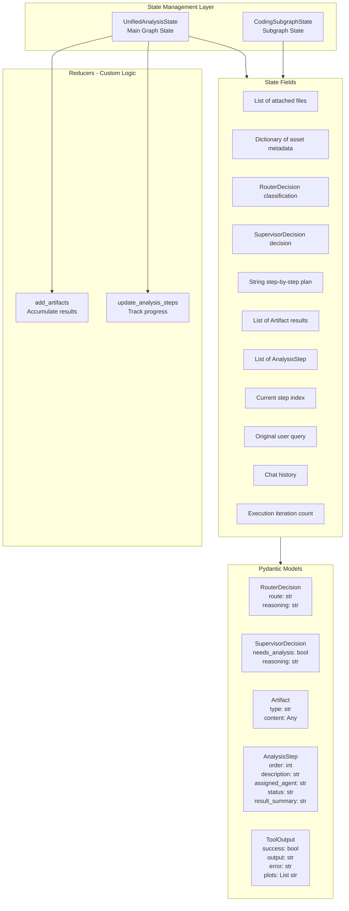
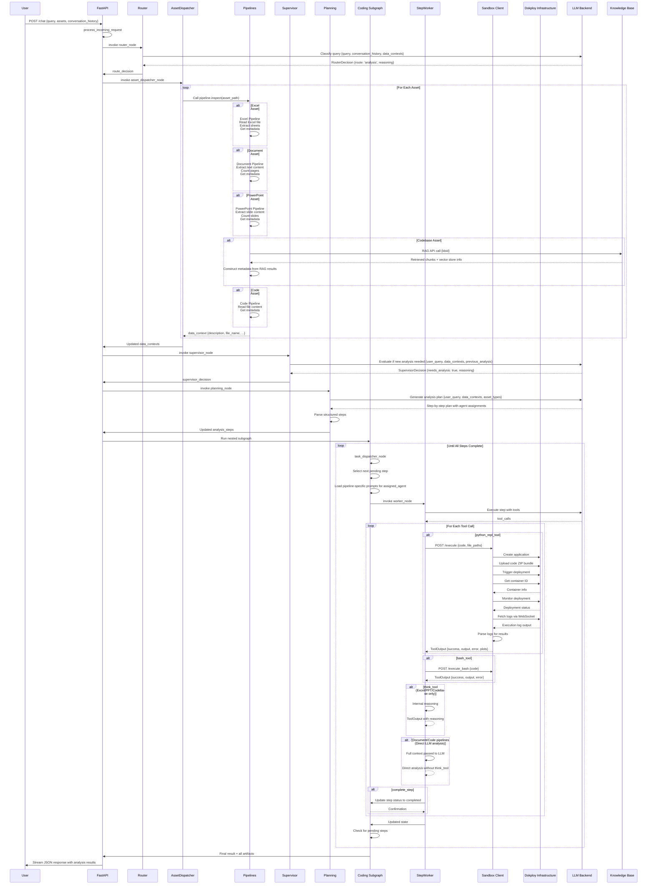
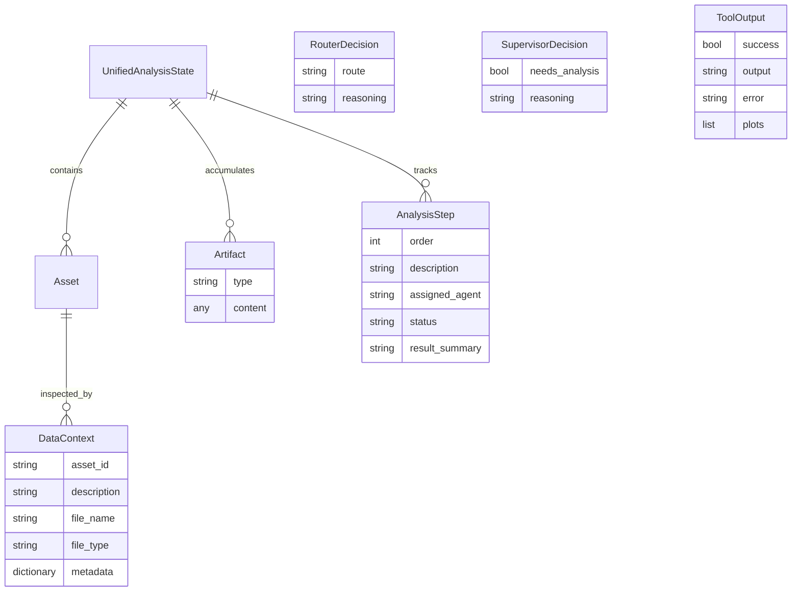
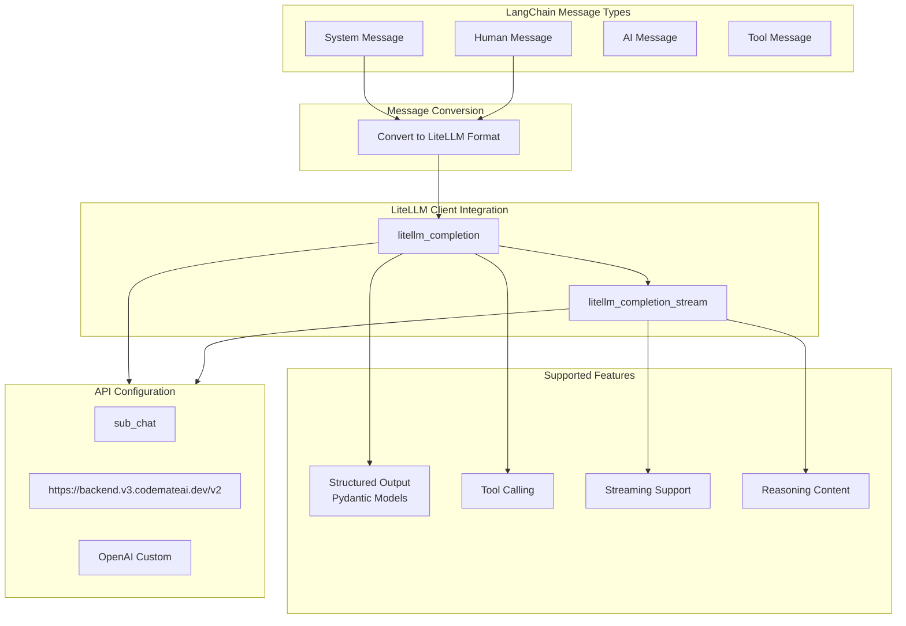

# Excel Analysis Agent - Architecture Documentation

## Overview

This document provides a comprehensive architecture diagram of the Multi-Asset Analysis Agent system. The system is built using **LangGraph** for workflow orchestration and supports analysis of Excel, Documents, PowerPoint, and Codebases.

## System Architecture Diagram

```mermaid
flowchart TD
    Start([User Request<br/>{query, assets?, conversation_history?}]) --> FastAPI
    
    subgraph External Services
        FastAPI[FastAPI Server<br/>/chat Endpoint]
        LLMAPI[LiteLLM Backend<br/>sub_chat Model]
        Dokploy[Dokploy Infrastructure<br/>Code Execution Container]
        KBService[Knowledge Base Service<br/>RAG API]
    end
    
    FastAPI --> MainGraph
    
    subgraph MainGraph[LangGraph Main Workflow]
        direction TB
        MainGraphEntry[Entry Point<br/>process_incoming_request]
        MainGraphEntry --> Router
        
        subgraph RouterNode[Router Node]
            LLMRouter[LLM Classification]
            Decision1{Route Decision}
        end
        
        Router --> Decision1
        
        Decision1 -->|'chat'| ChatNode[Chat Node<br/>Generic Conversational]
        Decision1 -->|'analysis'| AssetDispatcher
        Decision1 -->|'analysis_followup'| Supervisor
        
        subgraph AssetDispatcherNode[Asset Dispatcher Node]
            Loop1[For Each Asset]
            TypeCheck1[Check Asset Type]
            ExcelPipeline1[Excel Pipeline.inspect]
            DocPipeline1[Document Pipeline.inspect]
            PPTPipeline1[PowerPoint Pipeline.inspect]
            CodebasePipeline1[Codebase Pipeline.inspect]
            CodePipeline1[Code Pipeline.inspect]
            StoreDC1[Store in data_contexts]
        end
        
        AssetDispatcher --> Loop1
        Loop1 --> TypeCheck1
        TypeCheck1 -->|excel| ExcelPipeline1
        TypeCheck1 -->|document| DocPipeline1
        TypeCheck1 -->|powerpoint| PPTPipeline1
        TypeCheck1 -->|codebase| CodebasePipeline1
        TypeCheck1 -->|code| CodePipeline1
        ExcelPipeline1 --> StoreDC1
        DocPipeline1 --> StoreDC1
        PPTPipeline1 --> StoreDC1
        CodebasePipeline1 --> StoreDC1
        CodePipeline1 --> StoreDC1
        
        subgraph SupervisorNode[Supervisor Node]
            Evaluator[LLM Evaluation]
            Decision2{Needs New Analysis?}
        end
        
        AssetDispatcher --> Supervisor
        Supervisor --> Decision2
        
        Decision2 -->|Yes| Planning
        Decision2 -->|No| FollowupAnswer
        
        subgraph PlanningNode[Planning Node]
            PromptBuilder[Build Planning Prompt]
            StepGenerator[LLM Step Generation]
            ParseSteps[Parse Analysis Steps]
        end
        
        Supervisor --> Planning
        Planning --> ParseSteps
        
        ParseSteps --> CodingSubgraph
        
        subgraph CodingSubgraph[Coding Subgraph - Nested Graph]
            direction TB
            CodingEntry[Entry Point<br/>Isolated State]
            
            subgraph TaskDispatcherNode[Task Dispatcher Node]
                CheckPending[Check Pending Steps]
                SelectNext[Select Next Step]
                AgentConfig[Configure Agent Environment]
                PromptBuilder2[Build Step Prompt]
            end
            
            CodingEntry --> TaskDispatcherNode
            TaskDispatcherNode --> PromptBuilder2
            
            PromptBuilder2 --> StepWorker
            
            subgraph StepWorkerNode[Step Worker Node]
                ToolExecutor[Execute Tools]
                PythonREPL[python_repl_tool via Sandbox]
                BashTool[bash_tool via Sandbox]
                ThinkTool[think_tool]
                CompleteStep[complete_step tool]
            end
            
            StepWorker --> ToolExecutor
            ToolExecutor --> PythonREPL
            ToolExecutor --> BashTool
            ToolExecutor --> ThinkTool
            ToolExecutor --> CompleteStep
            
            PythonREPL --> UpdateStep[Update Step Status]
            BashTool --> UpdateStep
            ThinkTool --> UpdateStep
            CompleteStep --> UpdateStep
            
            UpdateStep --> CheckLoop{More Pending Steps?}
            CheckLoop -->|Yes| TaskDispatcherNode
            CheckLoop -->|No| CodingResult[Coding Subgraph Result]
        end
        
        FollowupAnswer --> StreamResponse[Stream Answer to User]
        CodingResult --> StreamResponse
        ChatNode --> StreamResponse
        
        subgraph StreamingLayer[Streaming Layer]
            Queue[AsyncIO Queue]
            Events[Event Stream]
        end
        
        StreamingLayer -.-> Queue
        Queue -.-> Events
    end
    
    MainGraph --> FastAPI
    FastAPI --> Response([Final Response to User])
    
    StreamResponse --> Queue
    
    LLMRouter -.->|API Call| LLMAPI
    Evaluator -.->|API Call| LLMAPI
    StepGenerator -.->|API Call| LLMAPI
    ToolExecutor -.->|API Call| LLMAPI
    
    CodebasePipeline1 -.->|RAG Query| KBService
    
    subgraph SandboxClient[Sandbox Microservice]
        Execute[execute_code Endpoint]
        WebSocketLogs[WebSocket Logs]
    end
    
    PythonREPL -.->|HTTP POST| Execute
    BashTool -.->|HTTP POST| Execute
    
    Execute -->|WebSocket| WebSocketLogs
    
    subgraph DokployClient[Dokploy Client Operations]
        CreateApp[create_application]
        UploadCode[upload_code ZIP bundle]
        SetBuildType[save_build_type]
        Deploy[deploy]
        Monitor[monitor_deployment]
        GetContainer[get_container_id]
        FetchLogs[fetch_logs WebSocket]
        ParseResults[parse_logs]
    end
    
    Execute -.->|Triggers| DokployClient
    DokployClient --> Dokploy
    
    style Start fill:#e1f5e1
    style FastAPI fill:#e1f1ff
    style MainGraph fill:#fff4e1
    style CodingSubgraph fill:#ffe1f5
    style External Services fill:#f0f0f0
    style StreamingLayer fill:#e1ffe1
    style SandboxClient fill:#f5e1ff
    style DokployClient fill:#ffe1e1
```

## Detailed Component Diagram



## Execution Flow Sequence



## Data Context Structure



## Pipeline Architecture

```mermaid
flowchart TB
    subgraph AssetPipeline[Asset Pipeline Interface]
        AbstractPipeline[AssetPipeline Abstract Class]
    end
    
    subgraph ConcretePipelines[Concrete Implementations]
        ExcelPipeline[Excel Pipeline]
        DocumentPipeline[Document Pipeline]
        PowerPointPipeline[PowerPoint Pipeline]
        CodebasePipeline[Codebase Pipeline]
        CodePipeline[Code Pipeline]
    end
    
    AbstractPipeline --> ExcelPipeline
    AbstractPipeline --> DocumentPipeline
    AbstractPipeline --> PowerPointPipeline
    AbstractPipeline --> CodebasePipeline
    AbstractPipeline --> CodePipeline
    
    subgraph PipelineMethods[Required Methods]
        Inspect[inspect file_path]
        GetPlanningSysPrompt[get_planning_system_prompt]
        GetPlanningUserPrompt[get_planning_user_prompt]
        GetCodingSysPrompt[get_coding_system_prompt]
        GetCodingUserPrompt[get_coding_user_prompt]
    end
    
    ExcelPipeline --> Inspect
    DocumentPipeline --> Inspect
    PowerPointPipeline --> Inspect
    CodebasePipeline --> Inspect
    CodePipeline --> Inspect
    
    subgraph PipelineCapabilities[Capabilities per Pipeline]
        ExcelCaps[Excel: Data extraction<br/>Sheet info<br/>Basic stats]
        DocumentCaps[Document: Text extraction<br/>Page count<br/>Metadata]
        PPTCaps[PowerPoint: Slide content<br/>Slide count<br/>Metadata]
        CodebaseCaps[Codebase: RAG retrieval<br/>Vector store<br/>Semantic search]
        CodeCaps[Code: Syntax analysis<br/>Logic extraction<br/>Code explanation<br/><b>Direct LLM analysis (no think_tool)</b>]
        CodebaseCaps[Codebase: RAG retrieval<br/>Vector store<br/>Semantic search]
        DocumentCaps[Document: Text extraction<br/>Page count<br/>Metadata<br/><b>Direct LLM analysis (no think_tool)</b>]
    end
    
    ExcelPipeline --> ExcelCaps
    DocumentPipeline --> DocumentCaps
    PowerPointPipeline --> PPTCaps
    CodebasePipeline --> CodebaseCaps
    CodePipeline --> CodeCaps
```

## Tool Execution Flow

```mermaid
flowchart LR
    subgraph StepExecution[Step Worker Node]
        LLMAgent[LLM Agent with Tools]
    end
    
    subgraph Tools[Available Tools]
        PythonREPL[python_repl_tool]
        BashTool[bash_tool]
        ThinkTool[think_tool<br/><b>Excel/PPT/Codebase only</b>]
        CompleteStep[complete_step]
    end
    
    LLMAgent --> PythonREPL
    LLMAgent --> BashTool
    LLMAgent --> ThinkTool
    LLMAgent --> CompleteStep
    
    subgraph SandboxOperations[Sandbox Client Operations]
        ExecuteCode[execute_code Endpoint]
    end
    
    PythonREPL --> ExecuteCode
    
    subgraph DokployFlow[Dokploy Deployment Flow]
        Step1[1. Create Application]
        Step2[2. Upload ZIP Bundle]
        Step3[3. Set Build Type]
        Step4[4. Trigger Deploy]
        Step5[5. Monitor Deployment]
        Step6[6. Get Container ID]
        Step7[7. Fetch Logs via WebSocket]
        Step8[8. Parse Result from Logs]
    end
    
    ExecuteCode --> DokployFlow
    
    Step1 --> Step2 --> Step3 --> Step4 --> Step5 --> Step6 --> Step7 --> Step8
    
    subgraph ParseLogic[Result Parsing]
        FindStart[Find __DOKPLOY_RESULT_START__ marker]
        ExtractContent[Extract content between markers]
        StripTimestamps[Strip Dokploy ISO timestamps]
        JSONParse[Parse JSON result]
    end
    
    Step8 --> ParseLogic
    
    subgraph ReturnValue[Returned ToolOutput]
        Success[success boolean]
        Output[output text]
        Error[error message if any]
        Plots[list of base64 plot images]
    end
    
    ParseLogic --> ReturnValue
    ReturnValue --> LLMAgent
```



## Streaming Architecture

```mermaid
flowchart TB
    subgraph Nodes[LangGraph Nodes]
        RouterNode[Router Node]
        AssetDispatcherNode[Asset Dispatcher Node]
        SupervisorNode[Supervisor Node]
        PlanningNode[Planning Node]
        StepWorkerNode[Step Worker Node]
    end
    
    subgraph EventTypes[Event Types]
        RouteDecision[route_decision]
        Artifact[artifact]
        AnalysisPlan[analysis_plan]
        ContentChunk[content_chunk]
        ReasoningChunk[reasoning_chunk]
    end
    
    subgraph Queue[AsyncIO Queue]
        QueueChannel[Shared Queue Channel]
    end
    
    RouterNode -.->|Put event| QueueChannel
    AssetDispatcherNode -.->|Put event| QueueChannel
    SupervisorNode -.->|Put event| QueueChannel
    PlanningNode -.->|Put event| QueueChannel
    StepWorkerNode -.->|Put event| QueueChannel
    
    subgraph FastAEPI[FastAPI Streaming]
        EventSource[EventSource Stream]
    end
    
    QueueChannel -.->|Consume| EventSource
    EventSource -.->|Send to Client| Client WebSocket[Client WebSocket]
    
    subgraph EventStructure[Event Structure]
        Type[type string]
        Node[node string]
        Message[message string]
        Payload[payload dictionary]
        Timestamp[timestamp ISO8601]
    end
    
    EventChannel -.-> EventStructure
```

## LLM Integration



## Key Architectural Patterns

### 1. Multi-Graph Pattern
- Main graph orchestrates high-level workflow
- Nested graph (Coding Subgraph) handles detailed execution
- Isolated state management between graphs
- Clear entry/exit points via reducer functions

### 2. Pluggable Pipeline Architecture
- Abstract `AssetPipeline` interface
- Concrete implementations per asset type
- Registry pattern for runtime pipeline discovery
- Consistent `inspect()` interface returning data context

### 3. Tool-Based Agent Design
- LLM agents equipped with tools
- Tools enforce constraints (e.g., codebase-specific execution)
- Tool execution tracked and validated
- Explicit step completion via `complete_step` tool
- **Conditional tool usage**: think_tool used only by Excel, PowerPoint, and Codebase pipelines
- **Direct LLM analysis**: Document and Code pipelines use full-context analysis without think_tool for faster execution

### 4. Streaming Event Architecture
- AsyncIO queue for real-time updates
- Event structure with type, node, and payload
- Multiple event types (decisions, content, reasoning)
- Client receives stream for progressive UI updates

### 5. Isolated Code Execution
- Sandbox microservice for safe Python execution
- Dokploy infrastructure for containerized execution
- HTTP-based communication with timeout handling
- WebSocket log streaming for result capture

### 6. State Management with Reducers
- Custom reducers for artifact accumulation
- Step status tracking with updates
- Immutable state updates following LangGraph patterns
- Separated state definitions for main/sub graphs

## Routing Logic Summary

| From Node | Condition | To Node |
|-----------|-----------|---------|
| Router | route == 'chat' | Chat |
| Router | route == 'analysis' AND NO data_contexts | AssetDispatcher |
| Router | route == 'analysis' AND existing data_contexts AND invalid_context | AssetDispatcher |
| Router | route == 'analysis' AND valid_context | Supervisor |
| Router | route == 'analysis_followup' | Supervisor |
| Router | route == 'analysis' AND invalid_data_context | END (failed validation) |
| Supervisor | needs_analysis == True | Planning |
| Supervisor | needs_analysis == False | FollowupAnswer |
| Planner | Completed | Coding Subgraph |
| Coding Subgraph | Loop until all steps complete | Step Worker |
| Coding Subgraph | All steps complete | Stack Pop (return to Main Graph) |